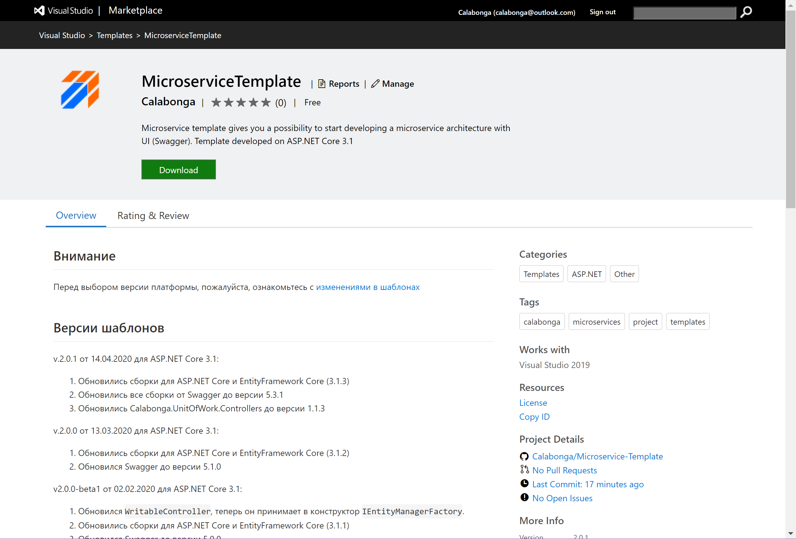

# Nimble Framework

>Attention! Please find out all comments with 'ATTENTION!' because that is required some decisions or actions from you.

## How to install

To install templates (`Visual Studio`, `Rider`, `dotnet CLI`) please, read [wiki](https://github.com/Calabonga/Microservice-Template/wiki) where you can find information about a simple way to use a command (command prompt) to install templates on your workstation. 

## Additional Information

* On the [developer's website](https://www.calabonga.net/blog/post/microservice-templates).
* Video presentation of the new version [Nimble Framework v.6](https://youtu.be/euOLhhNEcwg).

## Nimble Framework History

### 2025-03-08 Version 9.0.6

* Nuget-packages `IdentityModule` were updated.
    * `Calabonga.UnitOfWork` 6.0.0
    * `Swashbuckle.AspNetCore.SwaggerUI` 7.3.1
*  Nuget-packages `Module` were updated.
    * `Calabonga.UnitOfWork` 6.0.0
    * `Swashbuckle.AspNetCore.SwaggerUI` 7.3.1
* Default project name from template fixed.

### 2025-02-15 Version 9.0.3

* Nuget-packages updated `IdentityModule`.
* Nuget-packages updated `Module`.

### 2024-12-25 Version 9.0.2

* Updated NuGet packages in the `IdentityModule` project:
  * `OpenIddict.EntityFrameworkCore 6.0.0`
  * `OpenIddict.AspNetCore 6.0.0`
* OpenIddict updates for 6.0.0. The main change is that `Logout` has been changed to `EndSession`:
    ```diff
    - OpenIddictConstants.Permissions.Endpoints.Logout,
    + OpenIddictConstants.Permissions.Endpoints.EndSession,
    ```
* Created a new folder `AuthClientSamples` in the repository, which includes the `Calabonga.BlazorApp` project based on `Blazor Web App`, demonstrating the use of `Calabonga.Microservice.IdentityModule` as an authorization server for Blazor applications. More information and images on [Wiki](https://github.com/Calabonga/Microservice-Template/wiki/Blazor-Web-App-Sample).

### 2024-12-13 Version 9.0.1

* Connected `EnableLogoutEndpointPassthrough` endpoint and `SetIntrospectionEndpointUris`.
* Connected support for `PKCE` for `Authorization Code Flow`.
* Updated NuGet packages in the `IdentityModule` project.
* Updated NuGet packages in the `Module` project.

### 2024-11-26 Version 9.0.0

* Updated to platform version NET9.0, with corresponding NuGet packages installed.
* Connected `Microsoft.AspNetCore.OpenApi` as the main documentation generator.
* Removed `Swashbuckle.AspNetCore` NuGet package.
* Installed `Swashbuckle.AspNetCore.SwaggerUI` NuGet package for use as UI for interactive use of OpenApi documentation (`openapi/v1.json`).
* Updated CORS settings.
* Switched CI/CD build to use NET9.
* Removed the `Output` folder, where previous version builds were stored, from the repository.
* Removed the `VSIX` project from the repository as supporting this plugin is no longer feasible due to the ease of using Visual Studio templates.
* Removed the `IdentityServer4Mvc` folder from the repository, where MVC project forms for IdentityServer4 were stored.
* Removed the `Builder` project (folder `Builder`) from the repository, which allowed "manual" assembly of template projects. This functionality is no longer required.

### 2024-09-20 Version 8.0.6

* Updated NuGet packages in the `IdentityModule` project.
* Updated NuGet packages in the `Module` project.

### 2024-07-23 Version 8.0.5

* Updated NuGet packages in the `IdentityModule` project.
* Updated NuGet packages in the `Module` project.

### 2024-07-04 Version 8.0.4

* Updated NuGet packages in the `IdentityModule` project.
* Updated NuGet packages in the `Module` project.

### 2024-05-11 Version 8.0.3

* Updated NuGet packages in the `IdentityModule` project.
* Updated NuGet packages in the `Module` project.
* Fixed a template solution generation error: duplication of the sln file. Thanks [andrew-moiseyev](https://github.com/andrew-moiseyev).
* Updated NuGet template projects for both CLI tools.

### 2024-04-22 Version 8.0.2

* Updated NuGet packages.
* Fixed some syntax errors.

### 2024-02-06 Version 8.0.1

Instead of the NuGet package [`OperationResultCore`](https://github.com/Calabonga/OperationResult), a simpler and more modern implementation of RFC7807 - [`Calabonga.Results`](https://github.com/Calabonga/Calabonga.Results) is now used in both templates, which significantly "lightened" the serialization of output results, improving performance parameters several times.

* Removed `OperationResultCore` assembly from both templates.
* Installed `Calabonga.Results` assembly in both templates.
* Updated NuGet packages.
* Removed unnecessary archives of older versions on platforms below version 8.x.
* Removed artifacts that allowed generating templates without using template projects.

### 2023-11-20 Version 8.0.0

New and first version of the templates for microservices on the NET8 platform.


* Some refactoring of folders and corresponding namespaces in the templates to adhere to naming conventions.
* Updated NuGet packages.
* `IdentityModule`: added the possibility of authorization via `Bearer` in addition to `Cookie`.
* `IdentityModule`: added `PolicyCorsName` and `PolicyDefaultName`.
* `IdentityModule` and `Module`: updated implementation of `EventItemEndpoints` and `ProfilesEndpoints` to use `Endpoint Explorer` for generating `.http` files for method calls directly from `Visual Studio`:

     

* Connected `Microsoft.AspNetCore.OpenApi` for a complete implementation of `OpenApi`. Removed unnecessary dependencies.
* Other minor corrections, including syntactical ones.

### 2023-09-24 Version 7.0.8

* Removed source files for NET 5, as well as ready-made archives for using NET 5, from the repository.
* Updated NuGet packages.
* Minor optimizations in `appSettings.json` for `develop` and `production` deployments.
* Added mandatory check for potential NullReferenceException in the project file for each of the templates.
    ```diff
    -    <PropertyGroup>
    -        <TargetFramework>net7.0</TargetFramework>
    -        <Nullable>enable</Nullable>
    -        <ImplicitUsings>enable</ImplicitUsings>
    -    </PropertyGroup>
    +    <PropertyGroup>
    +        <TargetFramework>net7.0</TargetFramework>
    +        <Nullable>enable</Nullable>
    +        <ImplicitUsings>enable</ImplicitUsings>
    +        <TreatWarningsAsErrors>true</TreatWarningsAsErrors>
    +        <WarningsAsErrors>enable</WarningsAsErrors>
    +    </PropertyGroup>
    ```
* Updated `.editor.config` configuration.

    ```diff
    +[*.json]
    +
    +indent_size = 4
    +indent_style = space
    +tab_width = 4

    # C# files
    [*.cs]
    @@ -218,10 +223,15 @@ dotnet_naming_style.instance_field_style.required_prefix = _

    # ReSharper properties
    max_line_length = 200
    +resharper_arguments_anonymous_function = named
    +resharper_blank_lines_after_multiline_statements = 1
    +resharper_blank_lines_before_control_transfer_statements = 1
    +resharper_csharp_keep_blank_lines_in_code = 1
    resharper_csharp_max_line_length = 200
    resharper_csharp_wrap_after_declaration_lpar = true
    resharper_csharp_wrap_extends_list_style = chop_if_long
    resharper_csharp_wrap_lines = false
    +resharper_instance_members_qualify_declared_in = base_class
    resharper_max_attribute_length_for_same_line = 300
    resharper_place_type_constraints_on_same_line = true
    resharper_wrap_before_arrow_with_expressions = true
    ```

### 2023-08-07 Version 7.0.7

* Refactored folders in projects to achieve maximum compliance with the concept of Clean Architecture, specifically Vertical Slice Architecture.
* Updated NuGet packages of some base assemblies.
* Fixed minor issues (naming conventions, syntax issues, etc.).

### 2023-08-04 Version 7.0.6

Templates for `dotnet CLI` have been created. Now you can install templates very easily using the `dotnet` command. For example, to install the template for the `Microservice Identity Module`, simply execute the command:

``` bash
dotnet new install Calabonga.Microservice.IdentityModule.Template
```


To install the `Microservice Module`, use this command:

``` bash
dotnet new install Calabonga.Microservice.Module.Template
```

 

To check if the templates are installed, use the command:
``` bash
dotnet new list
```

The command will display a list of all installed templates::


Also, after installing the templates, they will become available in Visual Studio and JetBrains Rider.

### Visual Studio


### JetBrains Rider


### 2023-06-15 Version 7.0.5

* NuGet packages updated
* The class structure for descendants of `IRequest` and `IRequestHandler` has been slightly changed. Now requests with interceptors are combined into one class, which is actually much more convenient.
* Some Summary descriptions have been corrected

### 2023-05-22

[Example of using a template for building a backend (API) for a product catalog](https://github.com/Calabonga/Calabonga.Catalog). In this repository, a "step-by-step" implementation is recorded on video. You can see examples of using different mechanisms: Validation, Transactions, Notification, and more.

### 2023-04-15 Version 7.0.4

* NuGet packages updated for `AutoMapper`, `FluentValidation`, `Microsoft.AspNetCore.Authentication`, `Serilog`.
* Configuration for `Serilog` moved to `appSettings.json`
* `LoggerExtensions` removed as Structural logging based on `Serilog` is now connected.
* Since `StopTheHostException` has been renamed to `HostAbortedException`, it is now intercepted differently.
* Interception of `ValidationException` now works through `OperationResult`, for which `ValidatorBehavior` has been updated.

### 2023-03-11 Version 7.0.3

* NuGet packages updated for OpenIddict (OAuth2.0).
* The `GitInfo` package, which allowed versioning based on GIT, has been removed from the template as it caused an error when creating a project outside the repository folder: `NETSDK1018 Invalid NuGet version string: '0.0.0+main.'.`. Please review all comments labeled "ATTENTION!" as these areas will require some decisions or actions from you. For example, whether to use GIT-based versioning features.
* Fixed `FluentValidation` for `EventItemValidator`.
* Fixed `ErrorHandlerMiddleware` for displaying validation errors.

### 2023-02-24 Version 7.0.2 

This version received the following changes:

* The new version of `Mediatr` received an update, including the removal of the dependency on the `MediatR.Extensions.Microsoft.DependencyInjection` package. The dependency registration has also changed.

```diff
- services.AddMediatR(Assembly.GetExecutingAssembly());
+ services.AddMediatR(cfg => cfg.RegisterServicesFromAssemblyContaining<Program>());
```

* `EntityFramework` packages updated.
* The version of the Visual Studio extension (VSIX) has been updated.

### 2023-02-05 Version 7.0.1

* Almost all NuGet packages have been updated, including one of the most important, `OpenIddict`:

```diff
- <PackageReference Include="OpenIddict.AspNetCore" Version="3.1.1" />
+ <PackageReference Include="OpenIddict.AspNetCore" Version="4.0.0" />
```

* Fixed several syntax errors
* Updated methods in `IAccountService`, significantly reducing the number of repeated database queries for user information.

### 2022-11-12

The templates for creating microservice architecture projects have successfully migrated to NET7. All necessary NuGet package assemblies have been updated, and the projects themselves are now built on NET7. Don't forget to update CI/CD if you plan to publish new versions for NET7.

### 2022-10-02

New versions of the templates now work together. That is, an application created from the `Calabonga.Microservice.Module` template can authenticate with an application created from the `Calabonga.Microservice.IdentityModule` template right after the applications are created from the templates.

Since the updates were in different modules last time, the templates currently have different versions (This discrepancy will be resolved in the future):

* Calabonga.Microservice.IdentityModule has version `6.1.4`
* Calabonga.Microservice.Module has version `6.1.2`

### What's in the new version

* Updated assemblies (NuGet packages)
* Removed templates that used IdentityServer4 as the authorization server.
* Added the assembly [Calabonga.AspNetCore.AppDefinitions](https://www.nuget.org/packages/Calabonga.AspNetCore.AppDefinitions/), which enables the use of AppDefinitions in ASP.NET Core projects.

### 2022-09-03 Version 6.1.3

In the new version `6.1.3`, the `Authorization Code Flow` authorization method has been updated. Mechanisms from the example provided on the [OpenIddict Samples](https://github.com/openiddict/openiddict-samples) website have been implemented. Now, the authorization considers `Consent`, and stricter requirements for generating `id_token` and `access_token` have been introduced, as recommended by the `OAuth2.0` standards.


### 2022-07-26 Version 6.1.2

In the new version `6.1.2`, some initializations have been added to make it easier to connect the `EntityFramework` provider for `Microsoft SQL Server` (UseSqlClient). The added code lines have been commented so that the functionality can still be used for the IN-MEMORY mode.

### 2022-07-04 Version 6.1.1

In the new version `6.1.1`, projects have been removed from the FullAPI folder (along with the folder). The version with `IdentityServer` will no longer receive updates, but it will remain available. You can find it in the MinimalAPI-IS4 folder. If you still need these projects, I highly recommend forking my repository.

* Updated NuGet packages used in the templates (EntityFramework, FluentValidation).
* Removed old projects.
* Updated built archives for Visual Studio in the OUTPUT folder.

### 2022-05-14 Version 6.1.0

On the `NET6` platform (In the AspNetCore v6.1 folder), you can find a new version of `Nimble Framework`, which is designed for quickly creating microservice architectures. `Nimble Framework` includes `IdentityModule` (AuthServer) and Module (microservice). The new version is available for download.

* Removed IdentityServer4 as the basis for authentication and authorization based on OAuth2.0. Now, Nimble Framework uses OpenIddict for the authorization server template, which also implements OAuth2.0 specifications.
* Updated the authorization mechanism on the Swagger page. Now, Authorization Code Flow is used, which implements a login form. This will allow the template to be used "out of the box".
* Updated the authorization mechanism for secondary services (role transfer mechanism in the token).
* Updated almost all assemblies (migrated to NET6) used in the templates.
* Implemented the Definitions system.

### 2022-01-16 Version 6.0.1

1. Updated NuGet packages Automapper and Mediatr.
2. Updated assemblies for ASP.NET Core, EntityFrameworkCore.
3. Added information to the template about its build time and other copyright information.
4. Updated the template "builder" that allows quick updates of solutions.

[In the blog post](https://www.calabonga.net/blog/post/nimble-framework-v-6-1) and [Video presentation](https://youtu.be/xijBGwMEL8E)

### 2022-05-11

The implementation of `OpenIddict` in the templates is complete, and now templates for `Visual Studio` are being created.

### 2022-05-04

Work has begun to transition from IdentityServer4 to OpenIddict as the main OAuth2.0 authorization service. The reason for the move is the imminent end of support for IdentityServer4 and its transition to a paid model.

### 2021-11-21

On the NET6 platform (In the `AspNetCore v6.0` folder), there are now two types of microservice templates (FullAPI and MinimalAPI), each containing IdentityModel and a simple Module. The FullAPI folder contains the familiar microservice templates, but now they have been migrated to NET6. In the MinimalAPI folder, there is a new version of these templates, built based on [MinimalAPI](https://docs.microsoft.com/en-us/aspnet/core/fundamentals/minimal-apis?view=aspnetcore-6.0).

1. The microservice templates have been migrated to the new NET6 version. Almost all files have been updated, and new features introduced in C# have been used.
2. Updated assemblies for ASP.NET Core, EntityFrameworkCore, and Swagger (OpenAPI). Now, NET6 versions are used.
3. Duplicate controllers that demonstrated the Readonly/Writable approach (Calabonga.UnitOfWork.Controllers) have been removed. Now, only one example remains, built based on Mediatr.
4. Folder infrastructure has been updated. The Vertical Slice Architecture, presented by Jimmy Bogard, has been adopted.
5. Updated the VSIX extension for Visual Studio.

### 2021-11-01

1. Old templates for NET Core 2.2 and NET Core 3.0 have been removed.
2. Development of templates for the new version has started.

### 2021-09-06 Version 5.0.7

1. Updated assemblies for ASP.NET Core, EntityFrameworkCore, and Swagger (OpenAPI), as well as NuGet packages Calabonga.Microservices.Core, FluentValidation, and others.
2. Added several comments in the code to ensure clarity in actions.
3. Updated the VSIX extension for Visual Studio.

### 2021-10-31 Version 5.0.8

1. Updated assemblies for ASP.NET Core, EntityFrameworkCore, and Swagger (OpenAPI), as well as the NuGet package FluentValidation and others.
2. Converted some method constructions to lambda expressions to follow current trends.
3. Updated the VSIX extension for Visual Studio.

### 2021-09-08 Version 5.0.6

1. Updated assemblies for ASP.NET Core and EntityFrameworkCore, as well as NuGet packages OperationResultCore, Calabonga.Microservices.Core, Swagger, FluentValidation, and others.
2. Updated metadata used for the VSIX extension for Visual Studio.

### 2021-06-04 Version 5.0.5

1. Fixed several typos.
2. Updated assemblies for ASP.NET Core and EntityFrameworkCore, as well as NuGet packages OperationResultCore, Calabonga.Microservices.Core, Swagger, FluentValidation, and others.

### 2021-03-23 Version 5.0.4

1. The standard logger has been replaced with Serilog. It is now easier to read logs.
2. Fixed several typos.
3. Updated assemblies for ASP.NET Core and EntityFrameworkCore, as well as NuGet packages OperationResultCore, Calabonga.Microservices.Core, and others.
4. The implementation of Mediatr requests (Request) from classes has been converted into records (class -> record) in C#.

### 2021-03-16 Version 5.0.3

1. Removed dependencies on some assemblies that have been moved to a higher level. This will allow them to be updated separately.
2. Fixed several typos.
3. Updated assemblies for ASP.NET Core and EntityFrameworkCore to versions (5.0.4), as well as NuGet packages OperationResultCore, Calabonga.Microservices.Core, and others.
4. The implementation of Mediatr requests from controllers has been moved to template projects from the Calabonga.AspNetCore.Controllers assembly to make usage examples available to the developer.

## 2021-01-27 Version 5.0.2

1. Applied language features from C# 9.0. In other words, significant code refactoring for optimization.
2. Fixed several typos.
3. Updated assemblies for `ASP.NET Core` and `EntityFramework Core` to version (5.0.2). Also, updated NuGet packages `OperationResultCore`, `Calabonga.Microservices.Core`, and others.

## 2020-12-04 Version 5.0.1

1. In the microservice template with IdentityServer4 and the template without it, removed the xxx.Core projects. Files from these projects were moved to the xxx.Entities project. Links to Exceptions have been moved to the NuGet package `Calabonga.Microservices.Core`.
2. In the microservice template with IdentityServer4, added the ability to authenticate both as Cookie type and Bearer. Yes! Now both authentication types are configured.
3. Applied language features from C# 8.0. In other words, significant code refactoring for optimization.
4. Fixed numerous typos.

## 2020-11-15 Version 5.0.0

1. All projects in all solutions have been updated to .NET 5.0.
2. Updated NuGet packages for `ASP.NET Core` and `EntityFramework Core` (5.0.0).
3. Added logging implementation as an example usage, which is described in the video [ILogger in ASP.NET Core](https://youtu.be/09EVKgHgwnM).
4. Displayed branch name and commit number on the API page (`Swagger`).

# Documentation

The documentation is available on GitHub in the [Wiki](https://github.com/Calabonga/Microservice-Template/wiki/Nimble-Microservice-Templates).

# Microservices

Visual Studio project template for microservice module based on ASP.NET Core.

# Download

[ASP NET Core 3.1](https://github.com/Calabonga/microservice-template/tree/master/Output/AspNetCore-v.3.1) - Templates for ASP.NET Core 3.1 version

[ASP NET Core 5.0](https://github.com/Calabonga/microservice-template/tree/master/Output/AspNetCore-v.5.0) - Templates for ASP.NET Core 5.0 version

[ASP NET Core 6.0](https://github.com/Calabonga/microservice-template/tree/master/Output/AspNetCore-v.6.0) - Templates for ASP.NET Core 6.0 version

# Instructions and Additional Materials

[Installing Nimble Templates](https://www.calabonga.net/blog/post/install-nimble-framework-version-5)

[Calabonga.AspNetCore.Controllers](https://github.com/Calabonga/Calabonga.AspNetCore.Controllers/) NuGet package based on Mediatr

[Calabonga.UnitOfWork.Controllers](https://github.com/Calabonga/Calabonga.UnitOfWork.Controllers) NuGet package based on Readonly/Writable controllers

[Microservices: Microservice Template](https://www.calabonga.net/blog/post/microservises-template)

[Microservices: Access Management](https://www.calabonga.net/blog/post/mikroservisy-3-centralizovannoe-upravlenie-dostupom)

[Microservices: Data Exchange Between Microservices](https://www.calabonga.net/blog/post/reshenie-obmen-dannym-mezhdu-mikroservisami)

[Microservices: Proxy for frontend](https://www.calabonga.net/blog/post/odin-frontend-dolzhen-rabotat-tolko-so-svoim-backend)

[You can ask questions in the blog](https://www.calabonga.net/blog)

# Videos

Here are the videos related to NimbleFramework. They are categorized by version, but for a better understanding, it is highly recommended to check out all of them.

## Version 6.0

[Nimble Framework v6.1](https://youtu.be/xijBGwMEL8E)

[Nimble Framework v6.0](https://youtu.be/euOLhhNEcwg)

## Version 3.1 (3.0)

Part 0. [Nimble: Installing Templates for Microservices](https://youtu.be/rc0wvL0jlzc)

Part 1. [Nimble: Demonstrating the Microservice Template Example](https://youtu.be/N0dRGGV2iEg)

Part 2. [Nimble: Installing Templates for Microservices](https://youtu.be/rc0wvL0jlzc)

Part 3. [Nimble: Basic Concepts](https://youtu.be/WbSwp1Aa7hM)

Part 4. [Nimble: Creating Your Query and Handler for IMediator](https://youtu.be/wUfT5aLHVV8)

[Microservices 2](https://www.youtube.com/playlist?list=PLIB8be7sunXMh9dckizdXz65hLX_HRzlc) (Playlist)

## Version 2.2

[Microservices](https://www.youtube.com/playlist?list=PLIB8be7sunXMXTZKptqEtXAACpsYZdzi_) (Playlist)

# Visual Studio Extensions

Now, microservice generation templates are also available in the Visual Studio Marketplace.



[View on Marketplace](https://marketplace.visualstudio.com/items?itemName=Calabonga.microserivce-templates)

You can also install directly from Visual Studio:


# Additional Materials for Nimble Framework

[Microservices: Nimble Framework v.2](https://youtu.be/bTxruvbhDss)

[Nimble: Creating a Microservice](https://youtu.be/7nw8Naxf2U0)

Nimble Framework for .NET6 is coming soon.

# Acknowledgements

Support for the channel is welcome:

* <https://www.calabonga.net/site/thanks>

## Comments, Suggestions, and Remarks

Please leave your comments on the videos on the website [www.calabonga.net](https://www.calabonga.net)

# Author

Sergey Kalabonga (Calabonga)


# Contact Information

* [Programming Blog](https://www.calabonga.net)
* [Video Channel Boosty.to/Calabonga](https://boosty.to/Calabonga)
