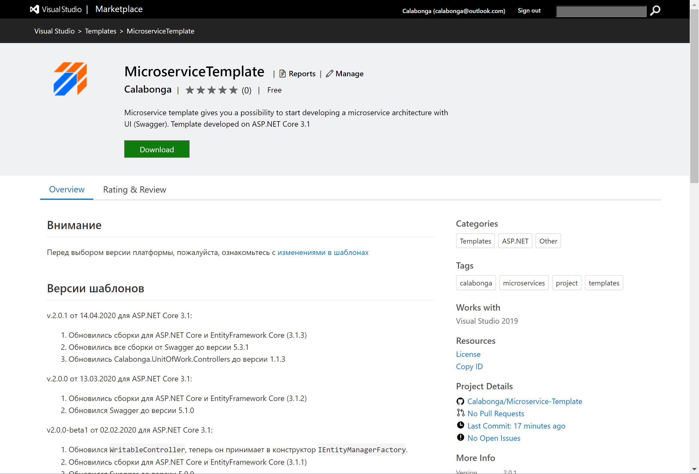
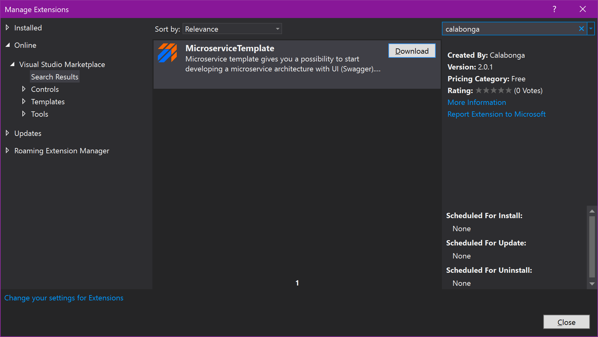

# Nimble Framework

Справочная информация по фреймворку есть в [Wiki](https://github.com/Calabonga/Microservice-Template/wiki) и на [сайте разработчика](https://www.calabonga.net/blog/post/microservice-templates). Видео презентация новой версии [Nimble Framework v.6](https://youtu.be/euOLhhNEcwg).

>Внимание (Attention)! Пожалуйста, ознакомьтесь со всеми комментариями с надписью "ATTENTION!", потому что эти места потребуют от вас некоторых решений и/или действий.
Please find out all comments with 'ATTENTION!' because that is required some decisions or actions from you.

## Новости Nimble Framework

### 2023-08-04

Созданы шаблоны для `dotnet CLI`. Теперь можно установить шаблоны очень просто через команду `dotnet`. Например, чтобы установить шаблон для `Microservice Identity Module` достаточно выполнить команду:

``` bash
dotnet new install Calabonga.Microservice.IdentityModule.Template
```


А для установки `Microservice Module` нужно такую команду:

``` bash
dotnet new install Calabonga.Microservice.Module.Template
```

 

Проверить установлены ли шаблоны можно командой 
``` bash
dotnet new list
```

Команда выведет список всех установленных шаблонов:


Также после установки шаблонов, они станут доступы в Visual Studio и JetBrains Rider.

### 2023-06-15

Версия 7.0.5:

* Обновлены nuget-пакеты
* Немного изменена структура классов для наследников от `IRequest` и `IRequestHandler`. Теперь запросы с перехватчиками объединены в один класс, что на самом деле гораздо удобнее.
* Поправлены некоторые описания Summary

### 2023-05-22

[Пример использования шаблона для построения backend (API) для каталога товаров](https://github.com/Calabonga/Calabonga.Catalog). В этом репозитории "пошаговая" реализация, которая записана на видео. Можно посмотреть примеры (examples of using) разных механизмов: Validation, Transactions, Notification and etc.

### 2023-04-15

Версия 7.0.4:

* Обновлены сборки (nuget) для `AutoMapper`, `FluentValidation`, `Microsoft.AspNetCore.Authentication`,`Serilog`.
* Конфигурация для `Serilog` вынесена в `appSettings.json`
* `LoggerExtensions` удалены, потому что подключено Structural logging на базе `Serilog`.
* Потому как `StopTheHostException` переименован `HostAbortedException` перехватывать его теперь стали по-новому.
* Перехват исключений `ValidationException` теперь работает через `OperationResult`, для этого обновлен `ValidatorBehavior`.

### 2023-03-11

Версия 7.0.3:

* Обновлены сборки (nuget) для OpenIddict (OAuth2.0).
* Из шаблона удалена сборка `GitInfo`, которая позволяла использовать версионирование на основе GIT, потому что при создании проекта вне папки репозитория появлялась ошибка: `NETSDK1018 Invalid NuGet version string: '0.0.0+main.'.`. Пожалуйста, ознакомьтесь со всеми комментариями с надписью "ATTENTION!", потому что эти места потребует от вас некоторых решений или действий. Например, использовать или не использовать версионирование на основе GIT возможностей.
* Исправлена работа `FluentValidation` для `EventItemValidator`.
* Исправлена работа `ErrorHandlerMiddleware` для отображения ошибок валидации.

### 2023-02-24

Версия 7.0.2 получила следующие изменения:

* Новая версия `Mediatr` получила обновление, в том числе была удалена зависимость от nuget-пакета `MediatR.Extensions.Microsoft.DependencyInjection`. А также изменилась регистрация зависимости.

``` diff
- services.AddMediatR(Assembly.GetExecutingAssembly());
+ services.AddMediatR(cfg => cfg.RegisterServicesFromAssemblyContaining<Program>());
```

* Обновились сборки `EntityFramework`.
* Обновилась версия для расширение для Visual Studio (VSIX).

### 2023-02-05

Новое в версии 7.0.1:

* Обновлены почти все nuget-пакеты, в том числе и один из самых важных `OpenIddict`:

``` diff
- <PackageReference Include="OpenIddict.AspNetCore" Version="3.1.1" />
+ <PackageReference Include="OpenIddict.AspNetCore" Version="4.0.0" />
```

* Исправлено несколько синтаксических ошибок
* Обновлены методы в `IAccountService`. За счет этого существенно сокращено количество повторяющихся запрос в базу данных за информацией о пользователе.

### 2022-11-12

Шаблоны для создания проектов для микросервисной архитектуры успешно мигрировали на NET7. Обновились сборки всех необходимых nuget-пакетов, а также сами проекты теперь строятся на NET7. Не забудьте обновить CI/CD если будете публиковать новые версии для NET7.

### 2022-10-02

Новые версии шаблонов теперь работают совместно. То есть теперь созданное приложение из шаблона `Calabonga.Microservice.Module` может авторизоваться у приложения, которое создано из шаблона `Calabonga.Microservice.IdentityModule` прямо после создания приложений из шаблонов.

В связи с тем, что обновления были в разных модулях в прошлый раз, шаблоны на данный момент имеют разные версии (В будущем это расхождение будет невелировано):

* Calabonga.Microservice.IdentityModule имеет версию `6.1.4`
* Calabonga.Microservice.Module имеет версию `6.1.2`

### Что в новой версии

* Обновлены сборки (nuget-пакеты)
* Удалены шаблоны, которые использовали IdentityServer4 в качестве сервера авторизации.
* Добавлена сборка [Calabonga.AspNetCore.AppDefinitions](https://www.nuget.org/packages/Calabonga.AspNetCore.AppDefinitions/), которая подключает возможность использования AppDefinitions в проектах на платформе ASP.NET Core.

### 2022-09-03

В новой версии `6.1.3` обновился метод авторизации по `Authorization Code Flow`. Подключены механизмы, которые приведены в пример на сайте [OpenIddict Samples](https://github.com/openiddict/openiddict-samples). Теперь авторизация учитывает `Consent`, а также подключены более жесткие требования к формированию `id_token` и `access_token`, которые рекомендованы стандартами `OAuth2.0`.


### 2022-07-26

В новой версии `6.1.2` добавлены некоторые инициализации для того, чтобы было проще подключить `EntityFramework` провайдер для  `Microsoft SQL Server` (UseSqlClient). Добавленные строки кода были закоментированы, чтобы можно было оставить функциональность для IN-MEMORY режима.

### 2022-07-04

В новой версии `6.1.1` удалены проекты из папки FullAPI (вместе с папкой). Версия с `IdentityServer` больше не будет получать обновления, но пока останется доступной. Вы можете ее найти в папке MinimalAPI-IS4. Если вам еще нужны эти проекты, настоятельно рекомендую сделать fork моего репозитория.

* Обновлены nuget-пакеты, которые использованы в шаблонах (EntityFramework, FluentValidation).
* Удалены старые проекты.
* Обновлены собранные архивы для Visual Studio в папке OUTPUT.

### 2022-05-14

На платформе `NET6` (В папке AspNetCore v6.1) можно найти новую версию `Nimble Framework`, который предназначен для быстрого создания микросервисной архитектуры. `Nimble Framework` содержит `IdentityModule` (AuthServer) и Module (microservice). Новая версия доступна для скачивания.

* Удален IdentityServer4 как основа для аутентификации и авторизации на базе OAuth2.0. Теперь Nimble Framework использует для шаблона с сервером авторизации OpenIddict, который также реализует спецификации OAuth2.0.
* Обновлен механизм авторизации на странице swagger. Теперь используется Authorization Code Flow, который реализует форму входа. Это позволит использовать шаблон "из коробки".
* Обновлен механизм авторизации для второстепенных сервисов (механизм передачи ролей в токен)
* Обновлены почти все сборки (переведены на NET6), которые использованы в шаблонах
* Реализована система Definitions

### 2022-01-16

Версия `v6.0.1`

1. Обновлены nuget-пакеты Automapper и Mediatr
2. Обновились сборки для ASP.NET Core, EntityFrameworkCore
3. Добавлена информация к шаблону о его времени сборке и прочая информация про Copyright
4. Обновлен "сборщик" шаблонов, который позволяет быстро обновлять solutions

[В статье блога](https://www.calabonga.net/blog/post/nimble-framework-v-6-1) и [Видео презентация](https://youtu.be/xijBGwMEL8E)

### 2022-05-11

Реализация `OpenIddict` в шаблонах завершена, теперь формируются шаблоны для `Visual Studio`.

### 2022-05-04

Начались работы по переходу от IdentityServer4 на OpenIddict как основной сервис авторизации OAuth2.0. Причина переезда - скорое окончание срока поддержки IdentityServer4 и перехода его на платную основу.

### 2021-11-21

На платформе NET6 (В папке `AspNetCore v6.0`) теперь существует два вида шаблонов микросервисов (FullAPI и MinimalAPI), каждый из которых содержит IdentityModel и простой Module. Папка FullAPI содержит уже знакомые шаблоны микросервисов, просто они теперь переведены на NET6. А в папке MinimalAPI новая версия тех же шаблонов, которые построены на базе [MinimalAPI](https://docs.microsoft.com/en-us/aspnet/core/fundamentals/minimal-apis?view=aspnetcore-6.0).

1. Шаблоны микросервисов переведены на новую версию NET6. Обновлены почти все файлы, использованы новые "фишки", которые появились в C#.
2. Обновились сборки для ASP.NET Core, EntityFrameworkCore и Swagger (OpenAPI). Теперь используются версии NET6.
3. Удалены дубликаты контроллеров, которые демонстрировали использовать подхода Readonly/Writable (Calabonga.UnitOfWork.Controllers). Теперь остался только один пример, построенный на базе Mediatr.
4. Обновлена инфраструктура папок. Использована Vertical Slice Architecture, которую представил Jimmy Bogard.
5. Обновилось расширение VSIX-расширения для Visual Studio.

### 2021-11-01

1. Удалены старые шаблоны для версий NET Core 2.2 и NET Core 3.0.
2. Началась разработка шаблонов для новой версии.

### 2021-09-06

Версия `v5.0.7`

1. Обновились сборки для ASP.NET Core, EntityFrameworkCore и Swagger (OpenAPI). А также nuget-пакеты Calabonga.Microservices.Core, FluentValidation и другие.
2. Добавлено несколько комментариев в код для обеспечения определенности в действиях
3. Обновилось расширение VSIX-расширения для Visual Studio.
4.

## 2021-10-31

Версия `v5.0.8`

1. Обновились сборки для ASP.NET Core, EntityFrameworkCore и Swagger (OpenAPI). А также nuget-пакет FluentValidation и другие.
2. Конструкции некоторых методов переведин на lambda-выражения, чтобы следовать моде.
3. Обновилось расширение VSIX-расширения для Visual Studio.

## 2021-09-08

Версия `v5.0.6`

1. Обновились сборки для ASP.NET Core и EntityFrameworkCore. А также nuget-пакеты OperationResultCore, Calabonga.Microservices.Core, Swagger, FluentValidation и другие.
2. Обновились метаданные, используемые для VSIX-расширения для Visual Studio.

## 2021-06-04

Версия `v5.0.5`

1. Исправлено несколько опечаток.
2. Обновились сборки для ASP.NET Core и EntityFrameworkCore. А также nuget-пакеты OperationResultCore, Calabonga.Microservices.Core, Swagger, FluentValidation и другие.

## 2021-03-23

Версия `v5.0.4`

1. Стандартный logger заменен на Serilog. Теперь читать логи стало проще.
2. Исправлено несколько опечаток.
3. Обновились сборки для ASP.NET Core и EntityFrameworkCore. А также nuget-пакеты OperationResultCore, Calabonga.Microservices.Core и другие.
4. Реализация Mediatr-запросов (Request) из классов превратились в записи (class -> record) С#.

## 2021-03-16

Версия `v5.0.3`

1. Удалена зависимость от некоторых сборок, которые вынесены на более высокий уровень. Это позволит обновлять их отдельно.
2. Исправлено несколько опечаток.
3. Обновились сборки для ASP.NET Core и EntityFrameworkCore до версий (5.0.4). А также nuget-пакеты OperationResultCore, Calabonga.Microservices.Core и другие.
4. Реализация Mediatr-запросов из контроллеров перенесены в проекты шаблонов из сборки Calabonga.AspNetCore.Controllers, чтобы примеры использования были доступны разработчику.

## 2021-01-27

Версия `v5.0.2`

1. Применены языковые *фишки* из C# 9.0. Другими словами, был неслабый рефакторинг кода для оптимизации.
2. Исправлено несколько опечаток.
3. Обновились сборки для `ASP.NET Core` и `EntityFramework Core` до версий (5.0.2). А также nuget-пакеты `OperationResultCore`, `Calabonga.Microservices.Core` и другие.

## 2020-12-04

Версия `v5.0.1`

1. В шаблоне микросервиса с IdentityServer4 и шаблоне без него удалены проекты xxx.Core. Файлы из этих проектов перенесены в проект xxx.Entities. Ссылки на Exceptions вынесены в nuget-пакет `Calabonga.Microservices.Core`.
2. В шаблоне микросервиса с IdentityServer4 добавлена возможность аутентификации как для Cookie типа, так и для Bearer. Да! Теперь настроено два типа аутентификации.
3. Применены языковые *фишки* из C# 8.0. Другими словами, был неслабый рефакторинг кода для оптимизации.
4. Исправлено множество опечаток.

## 2020-11-15

Версия `v5.0.0`

1. Все проекты во всех решениях (solutions) обновились до версии .NET 5.0.
2. Обновились nuget-сборки для `ASP.NET Core` и `EntityFramework Core` (5.0.0).
3. Добавилась реализация логирования, как пример использования, который описан на видео [ILogger в ASP.NET Core](https://youtu.be/09EVKgHgwnM)
4. На страницу API (`Swagger`) выведена информация о названии ветки (branch) и номер публикации (commit).

# Документация

Документация доступна на GitHub в разделе [Wiki](https://github.com/Calabonga/Microservice-Template/wiki/Nimble-Microservice-Templates) (в режиме наполнения).

# Микросервисы

Шаблон (template) для Visual Studio для построения инфраструктуры микросервисов на базе ASP.NET Core.

# Microservices

Visual Studio project template for microservice module base on ASP.NET Core

# Скачать (Download)

[ASP NET Core 3.1](https://github.com/Calabonga/microservice-template/tree/master/Output/AspNetCore-v.3.1) - Шаблоны для версии ASP.NET Core 3.1

[ASP NET Core 5.0](https://github.com/Calabonga/microservice-template/tree/master/Output/AspNetCore-v.5.0) - Шаблоны для версии ASP.NET Core 5.0

[ASP NET Core 6.0](https://github.com/Calabonga/microservice-template/tree/master/Output/AspNetCore-v.6.0) - Шаблоны для версии ASP.NET Core 6.0

# Инструкции и дополнительные материалы

[Установка Nimble Templates](https://www.calabonga.net/blog/post/install-nimble-framework-version-5)

[Calabonga.AspNetCore.Controllers](https://github.com/Calabonga/Calabonga.AspNetCore.Controllers/) nuget-пакет на базе Mediatr

[Calabonga.UnitOfWork.Controllers](https://github.com/Calabonga/Calabonga.UnitOfWork.Controllers) nuget-пакет на base Readonly/Writable controllers

[Микросервисы: Шаблон для микросервиса](https://www.calabonga.net/blog/post/microservises-template)

[Микросервисы: Управление доступом](https://www.calabonga.net/blog/post/mikroservisy-3-centralizovannoe-upravlenie-dostupom)

[Микросервисы: Обмен данными между микросервисами](https://www.calabonga.net/blog/post/reshenie-obmen-dannym-mezhdu-mikroservisami)

[Микросервисы: Прокси для frontend](https://www.calabonga.net/blog/post/odin-frontend-dolzhen-rabotat-tolko-so-svoim-backend)

[Вопросы можно задать в блоге](https://www.calabonga.net/blog)

# Видео

Про NimbleFramework можно найти следующие видео ролики. Они разделятся по версиям, но для всеобщего понимания настоятельно рекомендуется

## по версии 6.0

[Nimble Framework v6.1](https://youtu.be/xijBGwMEL8E)

[Nimble Framework v6.0](https://youtu.be/euOLhhNEcwg)

## по версии 3.1 (3.0)

Часть 0. [Nimble: Установка шаблонов для микросервисов](https://youtu.be/rc0wvL0jlzc)

Часть 1. [Nimble: Демонстрация шаблона микросервиса на примере](https://youtu.be/N0dRGGV2iEg)

Часть 2. [Nimble: Установка шаблонов для микросервисов](https://youtu.be/rc0wvL0jlzc)

Часть 3. [Nimble: Основные и базовые понятия](https://youtu.be/WbSwp1Aa7hM)

Часть 4. [Nimble: Создаем свой Query и Handler для IMediator](https://youtu.be/wUfT5aLHVV8)

[Микросервисы 2](https://www.youtube.com/playlist?list=PLIB8be7sunXMh9dckizdXz65hLX_HRzlc) (плей-лист)

## о по версии 2.2

[Микросервисы](https://www.youtube.com/playlist?list=PLIB8be7sunXMXTZKptqEtXAACpsYZdzi_) (плей-лист)

# Visual Studio Extensions

Теперь шаблоны для генерации микросервисов доступны также и в Visual Studio Marketplace



[Посмотреть marketplace](https://marketplace.visualstudio.com/items?itemName=Calabonga.microserivce-templates)

Также можно установить прямо из Visual Studio


# Дополнительные материалы по Nimble Framework

[Микросервисы: Nimble Framework v.2](https://youtu.be/bTxruvbhDss)

[Nimble: Создание микросервиса](https://youtu.be/7nw8Naxf2U0)

Nimble Framework для NET6 Готовится

# Благодарности

Благодарности помощь каналу принимаются (Support This Project):

* <https://www.calabonga.net/site/thanks>

## Комментарии, пожелания, замечания

Пишите комментарии к видео на сайте [www.calabonga.net](https://www.calabonga.net)

# Автор

Сергей Калабонга (Calabonga)


[Блог по программированию](https://www.calabonga.net)
