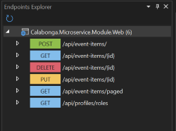
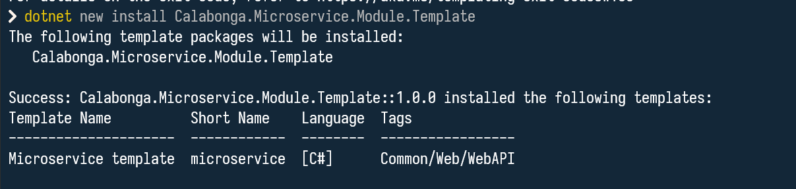
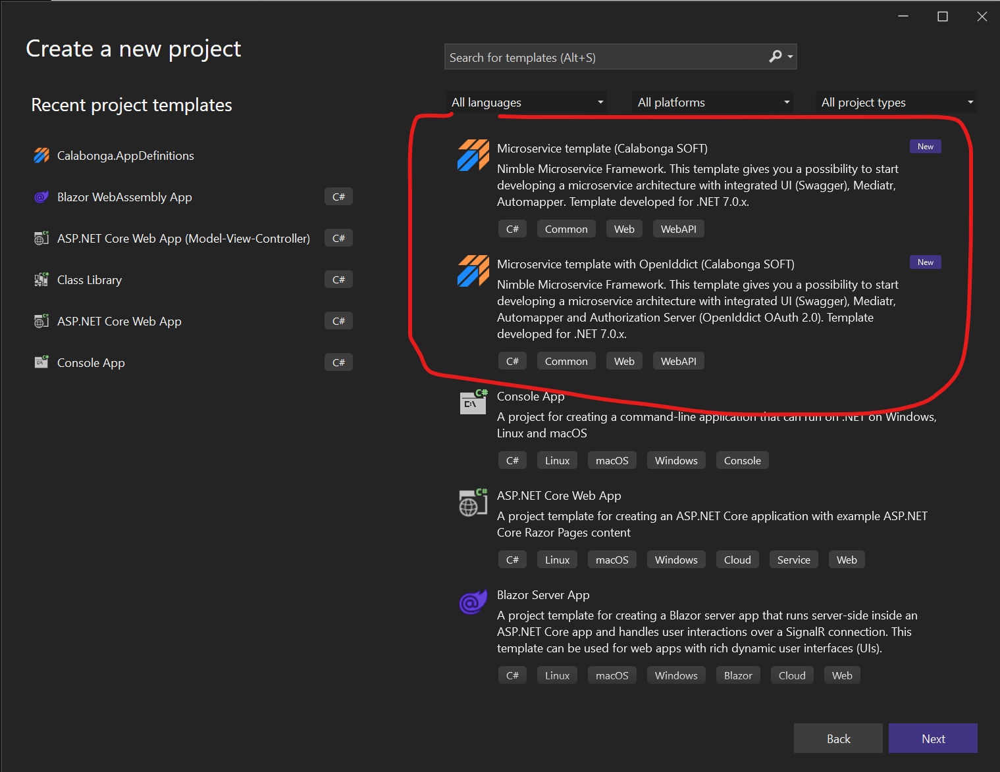
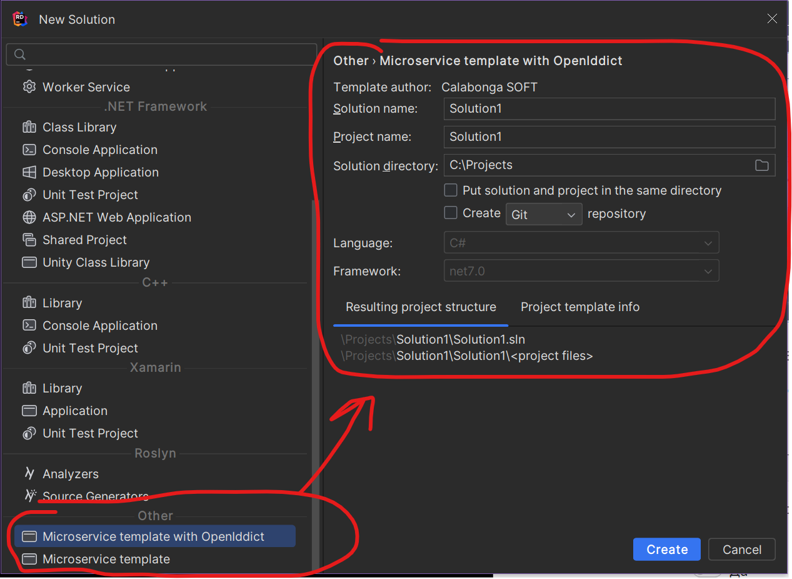

[](https://github.com/Calabonga/Microservice-Template/blob/master/README-en.md)

# Nimble Framework

>Внимание! Пожалуйста, ознакомьтесь со всеми комментариями с надписью "ATTENTION!", потому что эти места потребуют от вас некоторых решений и/или действий.

## Как установить (Install)

Для установки шаблонов в среду разработки (`Visual Studio`, `Rider`, `dotnet CLI`) пожалуйста прочитайте статью [wiki](https://github.com/Calabonga/Microservice-Template/wiki), в которой описано, как очень просто установить шаблоны при помощи одной команды из командной строки на ваш рабочий компьютер.

* [Calabonga.Microservice.IdentityModule.Template](https://www.nuget.org/packages/Calabonga.Microservice.IdentityModule.Template/) nuget-пакет для установки шаблона микросервиса в среду разработки (`Visual Studio`, `Rider`, `dotnet CLI`) с OpenIddict.
* [Calabonga.Microservice.Module.Template](https://www.nuget.org/packages/Calabonga.Microservice.Module.Template/) nuget-пакет для установки шаблона микросервиса в среду разработки (`Visual Studio`, `Rider`, `dotnet CLI`) без OpenIddict.

## Дополнительная информация

* На [сайте разработчика](https://www.calabonga.net/blog/post/microservice-templates). 
* Видео презентация новой версии [Nimble Framework v.6](https://youtu.be/euOLhhNEcwg).

## История Nimble Framework

### 2026-02-14 Версия 10.0.0

* Проекты в решении переведены на NET10.
* Nugets-пакеты обновлены в соотвествии с версией платформы.
* Добавлена новая схема `Bearer` авторизации для OpenApi.
* Обновлена схема `OAuth2.0` авторизации для OpenApi.
* Скриншоты
     
    
    
    
    
    
    
    


### 2025-09-11 Версия 9.2.0

* New ASP.NET Core RazorPages template added `Calabonga.AspNetCoreRazorPages.Template`

### 2025-09-04 Версия 9.1.1

* Nugets dependencies were updated

### 2025-06-16 Версия 9.1.0

* Сборка [MediatR](https://github.com/jbogard/MediatR) заменена на подобную [Mediator.Net](https://github.com/mayuanyang/Mediator.Net) в связи с тем, что ["MediatR is going commercial"](https://github.com/jbogard/MediatR/discussions/1105). Mediator.NET реализует всё, что есть в MediatR, только при помощи `SourceGenerator` - что означает, что в принципе отсутстует `Reflection`, что, в свою очередь, существенно влияет на производительность в положительную сторону.
* [Automapper](https://github.com/AutoMapper/AutoMapper) удален.
* Исправлены синтакситеческие опечатки.
* Обновлены некоторые зависимости (nuget-пакеты).

### 2025-06-13 Версия 9.0.7
* Обновились nuget-пакеты в проекте `IdentityModule`.
    * Microsoft.EntityFrameworkCore.Tools
    * Microsoft.EntityFrameworkCore.InMemory
    * OpenIddict.EntityFrameworkCore
    * Microsoft.EntityFrameworkCore
    * Microsoft.AspNetCore.Identity.EntityFrameworkCore*
    * FluentValidation
* Обновились nuget-пакеты в проекте `Module`.
    * Microsoft.EntityFrameworkCore
    * Microsoft.EntityFrameworkCore.InMemory
    * Microsoft.AspNetCore.Identity.EntityFrameworkCore
    * FluentValidation
    * FluentValidation.DependencyInjectionExtensions
    * MediatR
    * Microsoft.AspNetCore.Authentication.OpenIdConnect
    * Microsoft.AspNetCore.Authentication.JwtBearer
    * Microsoft.AspNetCore.Components.QuickGrid.EntityFrameworkAdapter
    * Microsoft.AspNetCore.OpenApi
    * Microsoft.EntityFrameworkCore.Tools

### 2025-03-08 Версия 9.0.6

* Обновились nuget-пакеты в проекте `IdentityModule`.
    * `Calabonga.UnitOfWork` 6.0.0
    * `Swashbuckle.AspNetCore.SwaggerUI` 7.3.1
* Обновились nuget-пакеты в проекте `Module`.
    * `Calabonga.UnitOfWork` 6.0.0
    * `Swashbuckle.AspNetCore.SwaggerUI` 7.3.1
* При создании нового проекта из шаблона теперь название задается правильно

### 2025-02-15 Версия 9.0.3

* Обновились nuget-пакеты в проекте `IdentityModule`.
* Обновились nuget-пакеты в проекте `Module`.

### 2024-12-25 Версия 9.0.2

* Обновились nuget-пакеты в проекте `IdentityModule`.
  * `OpenIddict.EntityFrameworkCore 6.0.0`
  * `OpenIddict.AspNetCore 6.0.0`
* OpenIddict обновления для 6.0.0. Их много, но основное то, что `Logout` изменен на `EndSession`:
    ```diff
    - OpenIddictConstants.Permissions.Endpoints.Logout,
    + OpenIddictConstants.Permissions.Endpoints.EndSession,
    ```
* Создана новая папка в репозитории `AuthClientSamples`, в которую добавлен проект `Calabonga.BlazorApp` на базе `Blazor Web App`, как демонстрация исползования `Calabonga.Microservice.IdentityModule` в качестве сервера авторизации Blazor-приложений.  Больше информации и c картинками на [Wiki](https://github.com/Calabonga/Microservice-Template/wiki/Blazor-Web-App-Sample).

### 2024-12-13 Версия 9.0.1

* Подключен `EnableLogoutEndpointPassthrough` endpoint, а также `SetIntrospectionEndpointUris`.
* Подключена поддержка `PKCE` для `Authorization Code Flow`.
* Обновились nuget-пакеты в проекте `IdentityModule`.
* Обновились nuget-пакеты в проекте `Module`.

### 2024-11-26 Версия 9.0.0

* Обновилась версия платформы NET9.0, установлены nuget-пакеты, соответствующие версии.
* Подключен `Microsoft.AspNetCore.OpenApi` как основной генератор документации.
* `Swashbuckle.AspNetCore` nuget-пакет удален.
* `Swashbuckle.AspNetCore.SwaggerUI` nuget-пакет установлен для использования как UI для интерактивного использования OpenApi документации (`openapi/v1.json`).
* Настройки CORS обновлены
* Сборка CI/CD переведена на использование NET9,
* Из репозитория удалена папка `Output`, где хранились собранные сборки предыдущих версий.
* Из репозитория удален проект (папка `VSIX`) с расширением для `Visual Studio`, так поддерживать данный плагин нецелесообразно, в виду просты использования шаблонов для Visual Studio.
* Из репозитория удалена папка `IdentityServer4Mvc`, где хранились формы MVC-проекта для IdentityServer4.
* Из репозитория удален проект `Builder` (папка Builder), который позволял "вручную" собирать проекты шаблонов. Данный функционал больше не требуется.

### 2024-09-20 Версия 8.0.6

* Обновились nuget-пакеты в проекте `IdentityModule`
* Обновились nuget-пакеты в проекте `Module`.

### 2024-07-23 Версия 8.0.5

* Обновились nuget-пакеты в проекте `IdentityModule`
* Обновились nuget-пакеты в проекте `Module`.

### 2024-07-04 Версия 8.0.4

* Обновились nuget-пакеты в проекте `IdentityModule`
* Обновились nuget-пакеты в проекте `Module`.

### 2024-05-11 Версия 8.0.3

* Обновились nuget-пакеты в проекте `IdentityModule`
* Обновились nuget-пакеты в проекте `Module`.
* Исправлена ошибка генерации решения из шаблона: дублирование sln-файла. Спасибо [andrew-moiseyev](https://github.com/andrew-moiseyev).
* Обновлены проекты nuget-templates для обоих tool CLI.


### 2024-04-22 Версия 8.0.2

* Обновились nuget-пакеты
* Исправлены некоторые синтаксические ошибки.


### 2024-02-06 Версия 8.0.1

Вместо nuget-пакета [`OperationResultCore`](https://github.com/Calabonga/OperationResult)в обоих шаблонах теперь используется более простая и современная реализация RFC7807 - [`Calabonga.Results`](https://github.com/Calabonga/Calabonga.Results), которая существенно "облегчила" сериализацию выдаваемых результатов повысив параметры производительности в несколько раз.

* Сборка `OperationResultCore` удалена из обоих шаблонов.
* Сборка `Calabonga.Results` установлена из обоих шаблонов.
* Обновились nuget-пакеты
* Удалены ненужные архивы старых версий на платформах ниже версии 8.x.
* Удалены артефакты, которые позволяли генерировать шаблоны без использования template-проектов.
 

### 2023-11-20 Версия 8.0.0

Новая и первая версия шаблонов для микросервисов на платформе NET8.

 

* Произведен некоторый рефакторинг папок и, соответственно, namespace в шаблонах, чтобы соблюсти договоренности о именованиях.
* Обновлены nuget-пакеты
* `IdentityModule`: добавлена возможно авторизации и по `Bearer` вдобавок к `Cookie`.
* `IdentityModule`: добавлена `PolicyCorsName` и `PolicyDefaultName`
* `IdentityModule` и `Module`: обновлена реализация `EventItemEndpoints` и `ProfilesEndpoints` чтобы можно было использовать `Endpoint Explorer` для генерации `.http` файлов для вызова методов прямо из `Visual Studio`:

     

* Подключена сборка `Microsoft.AspNetCore.OpenApi` для полноценной реализации `OpenApi`. Удалены ненужные зависимости.
* Произведены другие мелкие правки, в том числе синтаксические.


### 2023-09-24 Версия 7.0.8:

* Из репозитория удалены исходные файлы для NET 5, а также готовые архивы для использования NET 5.
* Обновлены nuget-пакеты
* Небольшие правки по оптимизации `appSettings.json` для `develop` и `production` развертывания.
* Добавлена обязательная проверка возможных NullReferenceException в файл проекта для каждого из шаблонов.
    ``` diff
    -    <PropertyGroup>
    -        <TargetFramework>net7.0</TargetFramework>
    -        <Nullable>enable</Nullable>
    -        <ImplicitUsings>enable</ImplicitUsings>
    -    </PropertyGroup>
    +    <PropertyGroup>
    +        <TargetFramework>net7.0</TargetFramework>
    +        <Nullable>enable</Nullable>
    +        <ImplicitUsings>enable</ImplicitUsings>
    +        <TreatWarningsAsErrors>true</TreatWarningsAsErrors>
    +        <WarningsAsErrors>enable</WarningsAsErrors>
    +    </PropertyGroup>
    ```
* Обновлена конфигурация `.editor.config`.

    ``` diff
    +[*.json]
    +
    +indent_size = 4
    +indent_style = space
    +tab_width = 4

    # C# files
    [*.cs]
    @@ -218,10 +223,15 @@ dotnet_naming_style.instance_field_style.required_prefix = _

    # ReSharper properties
    max_line_length = 200
    +resharper_arguments_anonymous_function = named
    +resharper_blank_lines_after_multiline_statements = 1
    +resharper_blank_lines_before_control_transfer_statements = 1
    +resharper_csharp_keep_blank_lines_in_code = 1
    resharper_csharp_max_line_length = 200
    resharper_csharp_wrap_after_declaration_lpar = true
    resharper_csharp_wrap_extends_list_style = chop_if_long
    resharper_csharp_wrap_lines = false
    +resharper_instance_members_qualify_declared_in = base_class
    resharper_max_attribute_length_for_same_line = 300
    resharper_place_type_constraints_on_same_line = true
    resharper_wrap_before_arrow_with_expressions = true
    ```

### 2023-08-07 Версия 7.0.7

* Сделан рефакторинг папок в проектах с целью добиться максимального соответствия концепции Clean Architecture, и в частности Vertical Slice Architecture. Выпущена
* Обновлены nuget-пакеты некоторых базовых сборок
* Исправлены мелкие недочеты (naming convention, syntax issies, etc.)

### 2023-08-04 Версия 7.0.6

Созданы шаблоны для `dotnet CLI`. Теперь можно установить шаблоны очень просто через команду `dotnet`. Например, чтобы установить шаблон для `Microservice Identity Module` достаточно выполнить команду:

``` bash
dotnet new install Calabonga.Microservice.IdentityModule.Template
```


А для установки `Microservice Module` нужно такую команду:

``` bash
dotnet new install Calabonga.Microservice.Module.Template
```

 

Проверить установлены ли шаблоны можно командой 
``` bash
dotnet new list
```

Команда выведет список всех установленных шаблонов:


Также после установки шаблонов, они станут доступы в Visual Studio и JetBrains Rider.

### Visual Studio



### JetBrains Rider



### 2023-06-15 Версия 7.0.5

* Обновлены nuget-пакеты
* Немного изменена структура классов для наследников от `IRequest` и `IRequestHandler`. Теперь запросы с перехватчиками объединены в один класс, что на самом деле гораздо удобнее.
* Поправлены некоторые описания Summary

### 2023-05-22

[Пример использования шаблона для построения backend (API) для каталога товаров](https://github.com/Calabonga/Calabonga.Catalog). В этом репозитории "пошаговая" реализация, которая записана на видео. Можно посмотреть примеры (examples of using) разных механизмов: Validation, Transactions, Notification and etc.

### 2023-04-15 Версия 7.0.4

* Обновлены сборки (nuget) для `AutoMapper`, `FluentValidation`, `Microsoft.AspNetCore.Authentication`,`Serilog`.
* Конфигурация для `Serilog` вынесена в `appSettings.json`
* `LoggerExtensions` удалены, потому что подключено Structural logging на базе `Serilog`.
* Потому как `StopTheHostException` переименован `HostAbortedException` перехватывать его теперь стали по-новому.
* Перехват исключений `ValidationException` теперь работает через `OperationResult`, для этого обновлен `ValidatorBehavior`.

### 2023-03-11 Версия 7.0.3

* Обновлены сборки (nuget) для OpenIddict (OAuth2.0).
* Из шаблона удалена сборка `GitInfo`, которая позволяла использовать версионирование на основе GIT, потому что при создании проекта вне папки репозитория появлялась ошибка: `NETSDK1018 Invalid NuGet version string: '0.0.0+main.'.`. Пожалуйста, ознакомьтесь со всеми комментариями с надписью "ATTENTION!", потому что эти места потребует от вас некоторых решений или действий. Например, использовать или не использовать версионирование на основе GIT возможностей.
* Исправлена работа `FluentValidation` для `EventItemValidator`.
* Исправлена работа `ErrorHandlerMiddleware` для отображения ошибок валидации.

### 2023-02-24 Версия 7.0.2 

Версия получила следующие изменения:

* Новая версия `Mediatr` получила обновление, в том числе была удалена зависимость от nuget-пакета `MediatR.Extensions.Microsoft.DependencyInjection`. А также изменилась регистрация зависимости.

``` diff
- services.AddMediatR(Assembly.GetExecutingAssembly());
+ services.AddMediatR(cfg => cfg.RegisterServicesFromAssemblyContaining<Program>());
```

* Обновились сборки `EntityFramework`.
* Обновилась версия для расширение для Visual Studio (VSIX).

### 2023-02-05 Версия 7.0.1

* Обновлены почти все nuget-пакеты, в том числе и один из самых важных `OpenIddict`:

``` diff
- <PackageReference Include="OpenIddict.AspNetCore" Version="3.1.1" />
+ <PackageReference Include="OpenIddict.AspNetCore" Version="4.0.0" />
```

* Исправлено несколько синтаксических ошибок
* Обновлены методы в `IAccountService`. За счет этого существенно сокращено количество повторяющихся запрос в базу данных за информацией о пользователе.

### 2022-11-12

Шаблоны для создания проектов для микросервисной архитектуры успешно мигрировали на NET7. Обновились сборки всех необходимых nuget-пакетов, а также сами проекты теперь строятся на NET7. Не забудьте обновить CI/CD если будете публиковать новые версии для NET7.

### 2022-10-02

Новые версии шаблонов теперь работают совместно. То есть теперь созданное приложение из шаблона `Calabonga.Microservice.Module` может авторизоваться у приложения, которое создано из шаблона `Calabonga.Microservice.IdentityModule` прямо после создания приложений из шаблонов.

В связи с тем, что обновления были в разных модулях в прошлый раз, шаблоны на данный момент имеют разные версии (В будущем это расхождение будет невелировано):

* Calabonga.Microservice.IdentityModule имеет версию `6.1.4`
* Calabonga.Microservice.Module имеет версию `6.1.2`

### Что в новой версии

* Обновлены сборки (nuget-пакеты)
* Удалены шаблоны, которые использовали IdentityServer4 в качестве сервера авторизации.
* Добавлена сборка [Calabonga.AspNetCore.AppDefinitions](https://www.nuget.org/packages/Calabonga.AspNetCore.AppDefinitions/), которая подключает возможность использования AppDefinitions в проектах на платформе ASP.NET Core.

### 2022-09-03 Версия 6.1.3

В новой версии `6.1.3` обновился метод авторизации по `Authorization Code Flow`. Подключены механизмы, которые приведены в пример на сайте [OpenIddict Samples](https://github.com/openiddict/openiddict-samples). Теперь авторизация учитывает `Consent`, а также подключены более жесткие требования к формированию `id_token` и `access_token`, которые рекомендованы стандартами `OAuth2.0`.


### 2022-07-26 Версия 6.1.2

В новой версии `6.1.2` добавлены некоторые инициализации для того, чтобы было проще подключить `EntityFramework` провайдер для  `Microsoft SQL Server` (UseSqlClient). Добавленные строки кода были закоментированы, чтобы можно было оставить функциональность для IN-MEMORY режима.

### 2022-07-04 Версия 6.1.1

В новой версии `6.1.1` удалены проекты из папки FullAPI (вместе с папкой). Версия с `IdentityServer` больше не будет получать обновления, но пока останется доступной. Вы можете ее найти в папке MinimalAPI-IS4. Если вам еще нужны эти проекты, настоятельно рекомендую сделать fork моего репозитория.

* Обновлены nuget-пакеты, которые использованы в шаблонах (EntityFramework, FluentValidation).
* Удалены старые проекты.
* Обновлены собранные архивы для Visual Studio в папке OUTPUT.

### 2022-05-14 Версия 6.1.0

На платформе `NET6` (В папке AspNetCore v6.1) можно найти новую версию `Nimble Framework`, который предназначен для быстрого создания микросервисной архитектуры. `Nimble Framework` содержит `IdentityModule` (AuthServer) и Module (microservice). Новая версия доступна для скачивания.

* Удален IdentityServer4 как основа для аутентификации и авторизации на базе OAuth2.0. Теперь Nimble Framework использует для шаблона с сервером авторизации OpenIddict, который также реализует спецификации OAuth2.0.
* Обновлен механизм авторизации на странице swagger. Теперь используется Authorization Code Flow, который реализует форму входа. Это позволит использовать шаблон "из коробки".
* Обновлен механизм авторизации для второстепенных сервисов (механизм передачи ролей в токен)
* Обновлены почти все сборки (переведены на NET6), которые использованы в шаблонах
* Реализована система Definitions

### 2022-01-16 Версия 6.0.1

1. Обновлены nuget-пакеты Automapper и Mediatr
2. Обновились сборки для ASP.NET Core, EntityFrameworkCore
3. Добавлена информация к шаблону о его времени сборке и прочая информация про Copyright
4. Обновлен "сборщик" шаблонов, который позволяет быстро обновлять solutions

[В статье блога](https://www.calabonga.net/blog/post/nimble-framework-v-6-1) и [Видео презентация](https://youtu.be/xijBGwMEL8E)

### 2022-05-11

Реализация `OpenIddict` в шаблонах завершена, теперь формируются шаблоны для `Visual Studio`.

### 2022-05-04

Начались работы по переходу от IdentityServer4 на OpenIddict как основной сервис авторизации OAuth2.0. Причина переезда - скорое окончание срока поддержки IdentityServer4 и перехода его на платную основу.

### 2021-11-21

На платформе NET6 (В папке `AspNetCore v6.0`) теперь существует два вида шаблонов микросервисов (FullAPI и MinimalAPI), каждый из которых содержит IdentityModel и простой Module. Папка FullAPI содержит уже знакомые шаблоны микросервисов, просто они теперь переведены на NET6. А в папке MinimalAPI новая версия тех же шаблонов, которые построены на базе [MinimalAPI](https://docs.microsoft.com/en-us/aspnet/core/fundamentals/minimal-apis?view=aspnetcore-6.0).

1. Шаблоны микросервисов переведены на новую версию NET6. Обновлены почти все файлы, использованы новые "фишки", которые появились в C#.
2. Обновились сборки для ASP.NET Core, EntityFrameworkCore и Swagger (OpenAPI). Теперь используются версии NET6.
3. Удалены дубликаты контроллеров, которые демонстрировали использовать подхода Readonly/Writable (Calabonga.UnitOfWork.Controllers). Теперь остался только один пример, построенный на базе Mediatr.
4. Обновлена инфраструктура папок. Использована Vertical Slice Architecture, которую представил Jimmy Bogard.
5. Обновилось расширение VSIX-расширения для Visual Studio.

### 2021-11-01

1. Удалены старые шаблоны для версий NET Core 2.2 и NET Core 3.0.
2. Началась разработка шаблонов для новой версии.

### 2021-09-06 Версия 5.0.7

1. Обновились сборки для ASP.NET Core, EntityFrameworkCore и Swagger (OpenAPI). А также nuget-пакеты Calabonga.Microservices.Core, FluentValidation и другие.
2. Добавлено несколько комментариев в код для обеспечения определенности в действиях
3. Обновилось расширение VSIX-расширения для Visual Studio.
4.

## 2021-10-31 Версия 5.0.8

1. Обновились сборки для ASP.NET Core, EntityFrameworkCore и Swagger (OpenAPI). А также nuget-пакет FluentValidation и другие.
2. Конструкции некоторых методов переведин на lambda-выражения, чтобы следовать моде.
3. Обновилось расширение VSIX-расширения для Visual Studio.

## 2021-09-08 Версия 5.0.6

1. Обновились сборки для ASP.NET Core и EntityFrameworkCore. А также nuget-пакеты OperationResultCore, Calabonga.Microservices.Core, Swagger, FluentValidation и другие.
2. Обновились метаданные, используемые для VSIX-расширения для Visual Studio.

## 2021-06-04 Версия 5.0.5

1. Исправлено несколько опечаток.
2. Обновились сборки для ASP.NET Core и EntityFrameworkCore. А также nuget-пакеты OperationResultCore, Calabonga.Microservices.Core, Swagger, FluentValidation и другие.

## 2021-03-23 Версия 5.0.4

1. Стандартный logger заменен на Serilog. Теперь читать логи стало проще.
2. Исправлено несколько опечаток.
3. Обновились сборки для ASP.NET Core и EntityFrameworkCore. А также nuget-пакеты OperationResultCore, Calabonga.Microservices.Core и другие.
4. Реализация Mediatr-запросов (Request) из классов превратились в записи (class -> record) С#.

## 2021-03-16 Версия 5.0.3

1. Удалена зависимость от некоторых сборок, которые вынесены на более высокий уровень. Это позволит обновлять их отдельно.
2. Исправлено несколько опечаток.
3. Обновились сборки для ASP.NET Core и EntityFrameworkCore до версий (5.0.4). А также nuget-пакеты OperationResultCore, Calabonga.Microservices.Core и другие.
4. Реализация Mediatr-запросов из контроллеров перенесены в проекты шаблонов из сборки Calabonga.AspNetCore.Controllers, чтобы примеры использования были доступны разработчику.

## 2021-01-27 Версия 5.0.2

1. Применены языковые *фишки* из C# 9.0. Другими словами, был неслабый рефакторинг кода для оптимизации.
2. Исправлено несколько опечаток.
3. Обновились сборки для `ASP.NET Core` и `EntityFramework Core` до версий (5.0.2). А также nuget-пакеты `OperationResultCore`, `Calabonga.Microservices.Core` и другие.

## 2020-12-04 Версия 5.0.1

1. В шаблоне микросервиса с IdentityServer4 и шаблоне без него удалены проекты xxx.Core. Файлы из этих проектов перенесены в проект xxx.Entities. Ссылки на Exceptions вынесены в nuget-пакет `Calabonga.Microservices.Core`.
2. В шаблоне микросервиса с IdentityServer4 добавлена возможность аутентификации как для Cookie типа, так и для Bearer. Да! Теперь настроено два типа аутентификации.
3. Применены языковые *фишки* из C# 8.0. Другими словами, был неслабый рефакторинг кода для оптимизации.
4. Исправлено множество опечаток.

## 2020-11-15 Версия 5.0.0

1. Все проекты во всех решениях (solutions) обновились до версии .NET 5.0.
2. Обновились nuget-сборки для `ASP.NET Core` и `EntityFramework Core` (5.0.0).
3. Добавилась реализация логирования, как пример использования, который описан на видео [ILogger в ASP.NET Core](https://youtu.be/09EVKgHgwnM)
4. На страницу API (`Swagger`) выведена информация о названии ветки (branch) и номер публикации (commit).

# Документация

Документация доступна на GitHub в разделе [Wiki](https://github.com/Calabonga/Microservice-Template/wiki/Nimble-Microservice-Templates)

# Микросервисы

Шаблон (template) для Visual Studio для построения инфраструктуры микросервисов на базе ASP.NET Core.

# Скачать

[ASP NET Core 3.1](https://github.com/Calabonga/microservice-template/tree/master/Output/AspNetCore-v.3.1) - Шаблоны для версии ASP.NET Core 3.1

[ASP NET Core 5.0](https://github.com/Calabonga/microservice-template/tree/master/Output/AspNetCore-v.5.0) - Шаблоны для версии ASP.NET Core 5.0

[ASP NET Core 6.0](https://github.com/Calabonga/microservice-template/tree/master/Output/AspNetCore-v.6.0) - Шаблоны для версии ASP.NET Core 6.0

# Инструкции и дополнительные материалы

[Установка Nimble Templates](https://www.calabonga.net/blog/post/install-nimble-framework-version-5)

[Calabonga.AspNetCore.Controllers](https://github.com/Calabonga/Calabonga.AspNetCore.Controllers/) nuget-пакет на базе Mediatr

[Calabonga.UnitOfWork.Controllers](https://github.com/Calabonga/Calabonga.UnitOfWork.Controllers) nuget-пакет на base Readonly/Writable controllers

[Микросервисы: Шаблон для микросервиса](https://www.calabonga.net/blog/post/microservises-template)

[Микросервисы: Управление доступом](https://www.calabonga.net/blog/post/mikroservisy-3-centralizovannoe-upravlenie-dostupom)

[Микросервисы: Обмен данными между микросервисами](https://www.calabonga.net/blog/post/reshenie-obmen-dannym-mezhdu-mikroservisami)

[Микросервисы: Прокси для frontend](https://www.calabonga.net/blog/post/odin-frontend-dolzhen-rabotat-tolko-so-svoim-backend)

[Вопросы можно задать в блоге](https://www.calabonga.net/blog)

# Видео

Про NimbleFramework можно найти следующие видео ролики. Они разделятся по версиям, но для всеобщего понимания настоятельно рекомендуется

## по версии 6.0

[Nimble Framework v6.1](https://youtu.be/xijBGwMEL8E)

[Nimble Framework v6.0](https://youtu.be/euOLhhNEcwg)

## по версии 3.1 (3.0)

Часть 0. [Nimble: Установка шаблонов для микросервисов](https://youtu.be/rc0wvL0jlzc)

Часть 1. [Nimble: Демонстрация шаблона микросервиса на примере](https://youtu.be/N0dRGGV2iEg)

Часть 2. [Nimble: Установка шаблонов для микросервисов](https://youtu.be/rc0wvL0jlzc)

Часть 3. [Nimble: Основные и базовые понятия](https://youtu.be/WbSwp1Aa7hM)

Часть 4. [Nimble: Создаем свой Query и Handler для IMediator](https://youtu.be/wUfT5aLHVV8)

[Микросервисы 2](https://www.youtube.com/playlist?list=PLIB8be7sunXMh9dckizdXz65hLX_HRzlc) (плей-лист)

## о по версии 2.2

[Микросервисы](https://www.youtube.com/playlist?list=PLIB8be7sunXMXTZKptqEtXAACpsYZdzi_) (плей-лист)

# Visual Studio Extensions

Теперь шаблоны для генерации микросервисов доступны также и в Visual Studio Marketplace


[Посмотреть marketplace](https://marketplace.visualstudio.com/items?itemName=Calabonga.microserivce-templates)

Также можно установить прямо из Visual Studio


# Дополнительные материалы по Nimble Framework

[Микросервисы: Nimble Framework v.2](https://youtu.be/bTxruvbhDss)

[Nimble: Создание микросервиса](https://youtu.be/7nw8Naxf2U0)

Nimble Framework для NET6 Готовится

# Благодарности

Благодарности помощь каналу принимаются (Support This Project):

* <https://www.calabonga.net/site/thanks>

## Комментарии, пожелания, замечания

Пишите комментарии к видео на сайте [www.calabonga.net](https://www.calabonga.net)

# Автор

Сергей Калабонга (Calabonga)


# Обратная связь

* [Блог о программировании](https://www.calabonga.net)
* [Видео канал Boosty.to/Calabonga](https://boosty.to/Calabonga)

## Внимание

При отправке кода в репозиторий настоятельно рекомендуется использовать преффиксы для текста сообщений для фиксаций (commits). Основные типы фиксаций:

* **test**: показывает процесс создания или изменения любого тестового кода. Пример: создание модульных тестов.
* **feat**: Указывает на то, что в проект была внедрена новая функция. Пример: добавление сервиса, функционала, конечной точки и т.д.
* **refactor**: Используется при рефакторинге кода, который не влияет на системную логику/правила. Пример: код меняется после проверки кода.
* **style**: Используется при изменении форматирования и стиля кода и не изменяет систему каким-либо образом. Пример: изменение стилистического руководства, изменение правила ворса, исправление отступов, удаление белых пробелов, удаление комментариев и т.д.
* **fix**: Используется для исправления ошибок, вызывающих ошибки в системе. Пример: применение коммита к функции, которая ведёт себя не так, как ожидалось, и приводит к ошибке.
* **chore**: Указывает изменения в проекте, которые не затрагивают системные или тестовые файлы. Это изменения в развитии. Пример: изменить правила eslint, добавить более красивые, добавить больше расширений для файлов в .gitignore
* **docs**: Используется при изменениях в документах проекта. Пример: добавление информации в документацию API, изменение README и т.д.
* **build**: используется для отображения изменений, влияющих на процесс сборки проекта или внешние зависимости. Пример: Gulp, добавление/удаление зависимостей NPM и т.д.
* **perf**: Указывает на изменение, улучшающее производительность системы. Пример: замена ForEach на While и так далее.
* **ci**: Используется для изменений в конфигурационных файлах CI. Пример: Circle, Travis, BrowserStack и др.
* **revert**: означает отмену предыдущей транзакции. Пример: отмена pull request, который был случайно объединён.